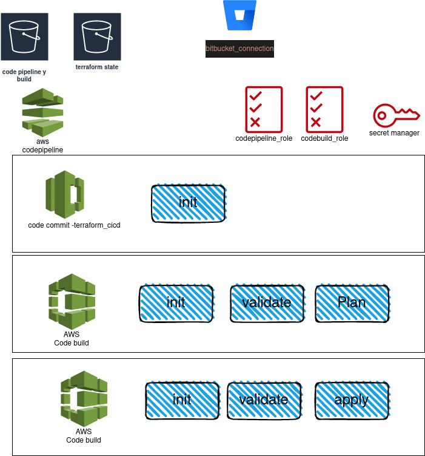

## Pre requisitos
1. Rol o usuario para poder hacer terraform apply desde local
2. credenciales en el caso de AWS seria access key y secret access key
3. configurar un archivo state.tf con el provider aws y apuntando al un bucket de s3
4. un buscket de s3 para poder guardar el state.tf de terraform 

## como usar
1. dentro de tu states.tf colocas el nombre de tu repositorio 
2. exporta las variables de entornos siguiente con la data de tus credenciales de AWS 
    - Nota:sino sabes como ve al apartado crear credenciales o ve el video 
   
 - cambia los valores por los tuyos y copia y pega en tu bash de linux 
3. ejecuta el comando make init o terraform init
4. ejecuta el comando make plan o terraform plan
5. ejecuta el comando make apply    o terraform apply
     - Nota: si deseas usar el comando make init o make plan debes ver el apartado usar docker con terraform
[mi canal](https://www.youtube.com/channel/UCfJ67eVA7DkKbbIF5ceJDMA)

6. luego tienes que instalar git remote codecommit 
7. has clone del repo y luego entra a la carpeta
8. agrega todos tus archivos de terraform a este nuevo repositorio y has push y listo


## docker con terraform

Para tener docker funcionando debes instalar docker engine y luego usar los comandos siguientes primero build para crear la imagen y luego run para correr

### comando para compilar el docker 
```docker build --tag=terraform .```

### comandos para ejecutar 
```docker run -it -v ${ruta}:/tmp -e AWS_ACCESS_KEY_ID=${AWS_ACCESS_KEY_ID} -e AWS_SECRET_ACCESS_KEY=${AWS_SECRET_ACCESS_KEY} terraform init```

### para repos en codecommit 
instala pip2
y luego usa este comando:
```sudo pip2 install git-remote-codecommit```
para finalizar usa el coamndo de clonado https grc
```git clone codecommit::us-east-1://terraform-cicd```